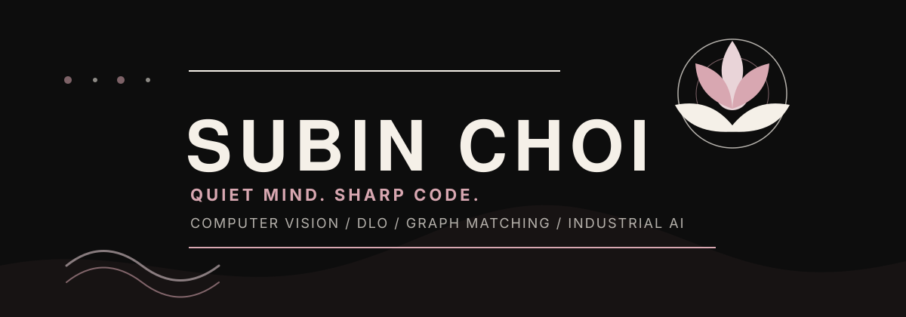
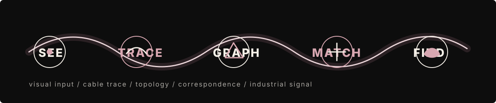
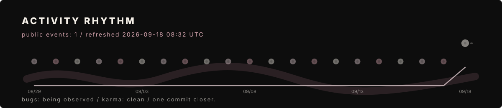
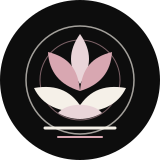

  

  
  
  

`Computer Vision` / `DLO` / `Graph Matching` / `Industrial AI`

quiet mind. sharp code.

 

## Field Notes

I build visual systems that notice small structure: parts, edges, traces, defects, mismatches, and the graph hidden under the image.

The current research rhythm is simple:

  

- **Computer Vision**: inspection, representation, visual reasoning, defect-sensitive perception
- **DLO**: deformable linear objects, cable-like structure, topology-aware recovery
- **Graph Matching**: node-edge consistency, correspondence, topology repair
- **Industrial AI**: practical models for messy visual data, controlled automation, robust failure checks

 

## Stack

  
  
  
  
  
  
  

 

## Public Work

<table>
  <tr>
    <td width="50%">
      <a href="https://github.com/subean-choi/atmosphere"><strong>atmosphere</strong></a> 
      public repository currently on the board  
      <code>interface</code> <code>visual system</code> <code>experiments</code>
    </td>
    <td width="50%">
      <strong>one commit closer.</strong> 
      more work appears as it becomes clean enough to leave the lab.  
      <code>bugs: being observed</code>
    </td>
  </tr>
</table>

 

## Activity Rhythm

  

`karma: clean` / `working tree: ...let's not talk about it` / `one commit closer.`

 

  

