  

<h1 align="center">SUBIN CHOI</h1>

  <code>computer vision monk in training</code> 
  번뇌는 많고, 코드는 계속 정리 중.

  
  
  

  <a href="#about">ABOUT</a> ·
  <a href="#inventory">INVENTORY</a> ·
  <a href="#karma-log">KARMA LOG</a>

---

## 01 / ABOUT

> I build computer vision systems that notice what human eyes might miss.

영상 속 작은 차이를 읽고, 복잡한 장면을 더 명확한 정보로 바꾸는 **Computer Vision** 시스템을 만듭니다.

<table>
  <tr>
    <td width="25%" align="center"><strong>LOOK</strong> observe closely</td>
    <td width="25%" align="center"><strong>THINK</strong> find the signal</td>
    <td width="25%" align="center"><strong>BUILD</strong> make it useful</td>
    <td width="25%" align="center"><strong>REPEAT</strong> one commit closer</td>
  </tr>
</table>

## 02 / INVENTORY

<strong>🪷 MAIN LOADOUT</strong> — 매일 손에 잡는 것들

 

  
  
  
  

<strong>🦶 SIDE QUESTS</strong> — 궁금하면 일단 밟아 봅니다

 

`computer vision` `image processing` `visualization` `automation`

<strong>💻 CURRENTLY DEBUGGING</strong> — 평온은 아직 실험 중

 

`clean interfaces` · `robust pipelines` · `reproducible experiments`

## 03 / PUBLIC PORTAL

<table>
  <tr>
    <td width="55%" valign="top">
      <h3>🪨 atmosphere</h3>
      
A public visual-system experiment currently outside the cave.

      <a href="https://github.com/subean-choi/atmosphere"><strong>ENTER REPOSITORY →</strong></a>
    </td>
    <td width="45%" valign="top">
      <h3>🧘 LAB STATUS</h3>
      
<code>mind: quiet-ish</code> <code>focus: computer vision</code> <code>bugs: being observed</code>

    </td>
  </tr>
</table>

## 04 / KARMA LOG

  

  public activity refreshes automatically · one commit closer

   
  <code>observe deeply. build carefully. ship calmly.</code>

