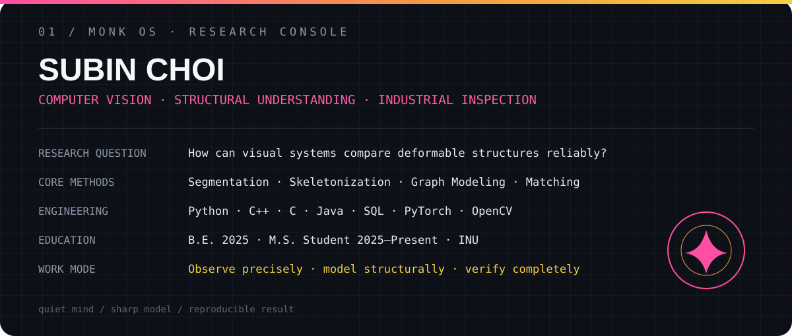
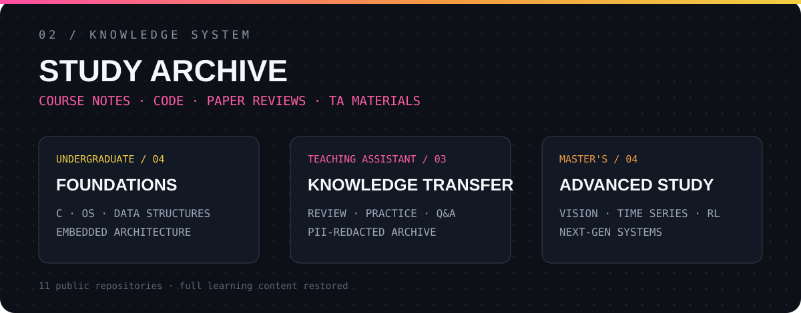
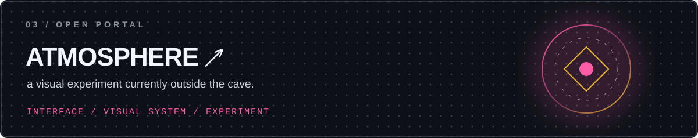

  

<h1 align="center">SUBIN / 최수빈</h1>

<code>computer vision, but make it zen.</code>

구조를 읽고 · 관계를 모델링하고 · 차이를 검증합니다

<strong>저장소 목록 펼치기</strong>

 

### 학부 전공
- [C 프로그래밍](https://github.com/subean-choi/inu-c-programming) — 2022 기말 실습 코드와 풀이
- [운영체제](https://github.com/subean-choi/inu-operating-systems) — 수업 필기와 어셈블리 실습
- [자료구조](https://github.com/subean-choi/inu-data-structures) — C 기반 자료구조와 알고리즘
- [임베디드 구조](https://github.com/subean-choi/inu-embedded-architecture) — 하드웨어·소프트웨어 구조

### TA
- [C언어 프로그래밍 TA](https://github.com/subean-choi/ta-c-programming)
- [임베디드시스템개론 TA](https://github.com/subean-choi/ta-intro-embedded-systems)
- [자료구조 TA](https://github.com/subean-choi/ta-data-structures)

### 석사 전공
- [시계열 데이터 분석](https://github.com/subean-choi/graduate-time-series-analysis)
- [컴퓨터비전 PBL](https://github.com/subean-choi/graduate-computer-vision-pbl)
- [차세대 시스템 설계 특론](https://github.com/subean-choi/graduate-next-gen-system-design)
- [강화학습 PBL](https://github.com/subean-choi/graduate-reinforcement-learning-pbl)

 

 복잡함은 덜고 · 관찰은 깊게 · 결과는 선명하게

