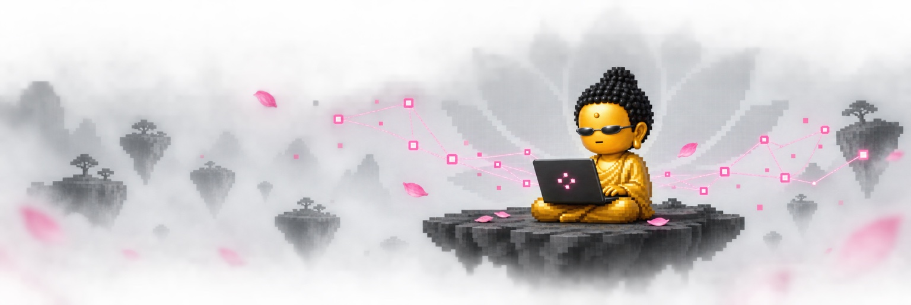

  

<h1 align="center">SUBIN / 최수빈</h1>

  <code>computer vision, but make it zen.</code>

  Computer Vision&nbsp;&nbsp;×&nbsp;&nbsp;Visual Systems&nbsp;&nbsp;×&nbsp;&nbsp;Quiet Chaos

 

  

 

## ABOUT

영상 속 작은 차이를 발견하고, 복잡한 정보를 더 선명하게 만드는 일을 합니다. 
조용히 보고, 오래 고민하고, 결국 돌아가는 것을 만듭니다.

I build computer vision systems with a focus on clarity, reliability, and real-world use.

 

## LOADOUT

  
  
  
  
  

 

## SELECTED WORK

<table>
  <tr>
    <td width="100%">
      <h3><a href="https://github.com/subean-choi/atmosphere">atmosphere ↗</a></h3>
      
A visual experiment currently outside the cave.

      <code>interface</code>&nbsp;&nbsp;<code>visual system</code>&nbsp;&nbsp;<code>experiment</code>
    </td>
  </tr>
</table>

 

<strong>🪷 CURRENT INNER STATE</strong>

 

`mind: calm-ish` 
`bugs: being observed` 
`deadline: approaching enlightenment` 
`working tree: emotionally unavailable`

<strong>🦶 SIDE QUESTS</strong>

 

`image processing` · `visualization` · `tiny experiments that became repositories`

 

   
  observe deeply · debug reluctantly · ship calmly

