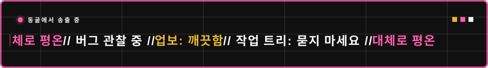

  

<h1 align="center">SUBIN / 최수빈</h1>

<code>computer vision, but make it zen.</code>

Structural Vision&nbsp;&nbsp;×&nbsp;&nbsp;Graph Reasoning&nbsp;&nbsp;×&nbsp;&nbsp;Reliable Inspection

<strong>OPEN / REPOSITORY INDEX</strong>

 

### Undergraduate
- [C Programming](https://github.com/subean-choi/inu-c-programming) — 2022 final practice code and explanations
- [Operating Systems](https://github.com/subean-choi/inu-operating-systems) — course notes and assembly practice
- [Data Structures](https://github.com/subean-choi/inu-data-structures) — C-based algorithms and implementations
- [Embedded Architecture](https://github.com/subean-choi/inu-embedded-architecture) — hardware–software structure

### Teaching Assistant
- [C Programming TA](https://github.com/subean-choi/ta-c-programming)
- [Introduction to Embedded Systems TA](https://github.com/subean-choi/ta-intro-embedded-systems)
- [Data Structures TA](https://github.com/subean-choi/ta-data-structures)

### Master's Coursework
- [Time Series Data Analysis](https://github.com/subean-choi/graduate-time-series-analysis)
- [Computer Vision PBL](https://github.com/subean-choi/graduate-computer-vision-pbl)
- [Next-Generation System Design](https://github.com/subean-choi/graduate-next-gen-system-design)
- [Reinforcement Learning PBL](https://github.com/subean-choi/graduate-reinforcement-learning-pbl)

 

 복잡함은 덜고 · 관찰은 깊게 · 결과는 선명하게

